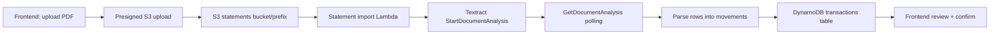

# Bank Statement Import Lambda Plan

## Goal
Import PDF bank statements and convert statement rows into reviewable transactions using AWS Textract.

## Scope
- Upload PDF bank statements to S3.
- Trigger a dedicated Lambda on PDF upload.
- Run asynchronous Textract analysis for tables and text.
- Parse statement rows into transaction candidates.
- Store imported rows in a review state until the user confirms them.

## Non-Goals
- Replacing the existing receipt upload flow.
- Auto-posting imported movements without user review.
- Building a full CSV/PDF parser inside the frontend.

## Proposed Architecture



### AWS Services
- S3 for PDF storage.
- Lambda for orchestration.
- Textract async document analysis for PDF pages and tables.
- DynamoDB for imported transaction candidates.
- CloudWatch for logs and failures.

## Workflow

1. The user uploads a bank statement PDF from the app.
2. The frontend requests a presigned PUT URL for the statement object.
3. The browser uploads the PDF directly to S3.
4. S3 triggers the statement import Lambda asynchronously.
5. Lambda identifies the statement metadata from the S3 key.
6. Lambda starts a Textract async job using `StartDocumentAnalysis`.
7. Lambda polls or resumes with `GetDocumentAnalysis` until the full document is ready.
8. Lambda extracts row-level data from the Textract blocks.
9. Lambda maps each row to a transaction candidate.
10. Lambda stores the extracted movements as `PENDING_REVIEW`.
11. The user reviews, edits, and confirms the imported movements in the UI.

## Textract Strategy

Use Textract document analysis for PDF statements, not the receipt expense API.

- `StartDocumentAnalysis` when the statement contains tables or forms.
- `StartDocumentTextDetection` only if a plain-text fallback is needed.
- `AnalyzeExpense` remains reserved for receipt uploads.

## Suggested S3 Key Format

```text
statements/{userId}/{statementMonth}/{statementId}/{filename}
```

Example:

```text
statements/user-abc/2025-07/stmt-xyz/bank-statement.pdf
```

## Data Mapping

Each statement row should be normalized into a transaction candidate with:
- transaction date
- description / merchant
- debit or credit amount
- balance when present
- statement source metadata

Recommended normalization rules:
- Debit rows become negative amounts.
- Credit rows become positive amounts.
- Empty or ambiguous rows stay in review mode.
- Duplicate rows should be deduplicated by statement id + date + amount + description.

## Lambda Responsibilities

- Validate the S3 event and statement file type.
- Extract statement metadata from the S3 key.
- Start and track Textract document jobs.
- Parse Textract blocks into rows.
- Normalize amounts and dates.
- Create or update DynamoDB items.
- Log processing metrics and failures.

## Error Handling

- If S3 access fails, log and stop.
- If Textract fails or times out, mark the statement as `PENDING_REVIEW`.
- If row parsing is incomplete, preserve raw text and table fragments for manual review.
- If the PDF is not a valid statement, reject it with a clear validation error.

## Delivery Phases

### Phase 1 - Storage and Trigger
- Add a statements S3 prefix/bucket.
- Add a presigned upload endpoint for PDFs.
- Wire S3 upload events to a new Lambda.

### Phase 2 - Textract Integration
- Implement async document analysis.
- Poll or resume Textract jobs.
- Store raw Textract output for debugging.

### Phase 3 - Row Parsing
- Parse tables into transaction candidates.
- Normalize dates, descriptions, and amounts.
- Add deduplication rules.

### Phase 4 - Review Experience
- Surface imported movements in the Transactions page.
- Allow edit/confirm flows before final save.
- Add validation states and error messages.

## Concrete Backend Tasks

The tasks below are implementation-ready for this codebase.

### Task B1 - Extend upload API for statement PDFs

- Files:
  - `src/backend/src/routes/uploadRoutes.ts`
  - `src/backend/src/services/S3Service.ts`
  - `src/backend/src/server.ts` (routes list only)
- Changes:
  - Add `POST /api/uploads/presign-statement` (JWT-protected).
  - Validate `filename` and `contentType` (`application/pdf`).
  - Add `buildStatementKey({ userId, statementId, filename })` in `S3Service`.
  - Return `{ url, key, statementId }`.
- Acceptance criteria:
  - Endpoint rejects non-PDF content types with `400`.
  - Key format is `statements/{userId}/{year-month}/{statementId}/{filename}`.
  - Existing receipt upload route behavior remains unchanged.

### Task B2 - Add statement import Lambda (async Textract)

- Files:
  - `src/backend/lambda/statementImportProcessor.ts` (new)
  - `src/backend/lambda-pkg/statementImportProcessor.js` (build artifact if committed)
  - `src/backend/package.json` (dependencies/scripts if needed)
- Changes:
  - Implement S3-triggered handler for `statements/` prefix.
  - Start Textract job via `StartDocumentAnalysis` (feature types: `TABLES`, `FORMS`).
  - Handle job completion retrieval via `GetDocumentAnalysis` (polling or follow-up invocation pattern).
  - Persist raw Textract metadata for traceability.
- Acceptance criteria:
  - Lambda ignores non-PDF objects.
  - Multi-page statements are processed end-to-end.
  - Failures are logged with enough context (`bucket`, `key`, `statementId`, `jobId`).

### Task B3 - Parse Textract blocks into normalized movements

- Files:
  - `src/backend/lambda/statementImportProcessor.ts`
  - `src/backend/src/services/TransactionService.ts` (helper methods if shared)
- Changes:
  - Extract row candidates from table blocks.
  - Normalize fields: date, description, debit/credit, signed amount, optional balance.
  - Add dedup key: `statementId + date + amount + description`.
  - Keep ambiguous rows as review candidates with raw row text.
- Acceptance criteria:
  - Debit rows are negative, credit rows are positive.
  - Unparseable rows are not dropped silently.
  - Parser returns deterministic output for identical Textract input.

### Task B4 - Persist imported rows in review state

- Files:
  - `src/backend/src/services/TransactionService.ts`
  - `src/backend/src/models/Transaction.ts`
  - `src/backend/lambda/statementImportProcessor.ts`
- Changes:
  - Add a transaction source marker (example: `source: 'STATEMENT_IMPORT' | 'RECEIPT' | 'MANUAL'`).
  - Store imported rows with status `PENDING_REVIEW`.
  - Add statement metadata fields (example: `statementId`, `statementKey`, `importedAt`).
- Acceptance criteria:
  - Imported rows appear in normal transaction queries for the owner user.
  - Imported rows are editable/confirmable through existing update flow.
  - Existing receipt/manual transaction writes continue to work.

### Task B5 - Infrastructure and IAM updates

- Files:
  - `terraform/receipt_processor/main.tf` (or dedicated module for statement lambda)
  - `terraform/main.tf`
  - `terraform/outputs.tf`
- Changes:
  - Add Lambda resource, role, and policies for Textract async APIs:
    - `textract:StartDocumentAnalysis`
    - `textract:GetDocumentAnalysis`
  - Add S3 event notification for `statements/` prefix and `.pdf` suffix.
  - Add env vars (`STATEMENT_IMPORT_TABLE` if separate, `AWS_REGION`, etc.).
- Acceptance criteria:
  - Terraform plan shows new resources without breaking receipt pipeline resources.
  - Statement upload triggers only the statement Lambda.
  - Least-privilege IAM policies are enforced.

### Task B6 - API and operational visibility

- Files:
  - `README.md`
  - `contracts/` (new contract doc for statement import)
  - `src/backend/src/server.ts` (route list)
- Changes:
  - Document endpoint and processing behavior.
  - Add runbook notes for failed statement jobs and retry strategy.
  - Define CloudWatch log patterns and alert thresholds.
- Acceptance criteria:
  - A developer can run the import flow locally/test env using docs only.
  - On-call can identify failing statements via logs and job ids.

### Task B7 - Tests

- Files:
  - `src/backend/tests/unit/` (new parser tests)
  - `src/backend/tests/integration/` (new upload+import tests)
- Changes:
  - Unit-test date/amount normalization and dedup logic.
  - Integration-test `presign-statement` endpoint auth/validation.
  - Integration-test happy-path import creating `PENDING_REVIEW` transactions.
- Acceptance criteria:
  - Parser edge cases are covered (empty rows, malformed amounts, mixed debit/credit formats).
  - Endpoint validation tests fail for non-PDF and missing filename.
  - CI passes with the new tests included.

## Execution Order (Backend)

1. B1 upload endpoint and S3 key helper.
2. B5 infrastructure and IAM.
3. B2 statement Lambda scaffolding.
4. B3 parser implementation.
5. B4 persistence integration.
6. B7 tests.
7. B6 docs/runbook finalization.

## Definition of Done

- PDF statement upload URL can be requested and used.
- Statement PDF upload triggers Lambda and Textract async analysis.
- Parsed movements are stored as `PENDING_REVIEW` transactions.
- Imported movements can be edited/confirmed via existing transaction update flow.
- Terraform, tests, and docs are updated and passing.

## Open Questions
- Should statement imports use a dedicated table or reuse the transactions table with a new source field?
- Should the Lambda be implemented in Python to match the receipt processor or in TypeScript to align with the backend?
- Do we need a separate UI tab for statement uploads or a shared upload flow with receipt import?
